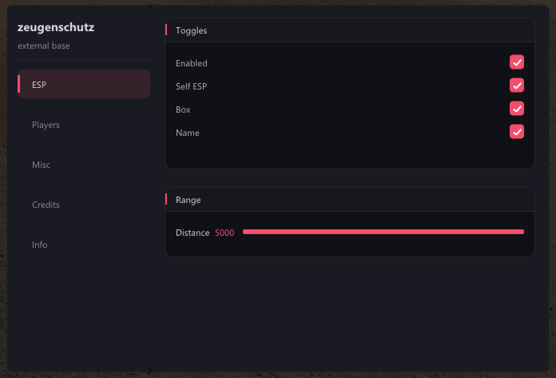
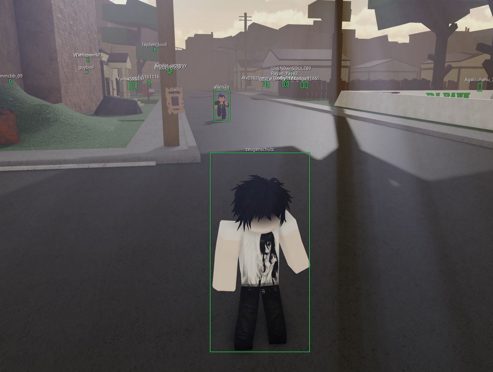

# zeugenschutz base

External Roblox base in C++. ImGui overlay, DataModel walk, per-frame ESP.
Not a full cheat — a starting point.

## Build

- Visual Studio 2022, toolset v143, Windows 10 SDK
- Open `ZeugenschutzBase.sln`
- Release / x64 → Build
- Output: `build/Release/zeugenschutz.exe`
- Runs as admin (UAC manifest is set in the vcxproj)

## What's in

- Offset fetch at startup from `rbxoffsets.xyz` — no rebuild per Roblox update
- 4-pass Roblox window resolver — survives zombie PIDs, Byfron masking, invisible loads
- Sidebar-tabbed ImGui with card sections
- ESP: box + name, self toggle, distance slider
- Players tab with substring search
- Watermark showing live Roblox version + clock
- Config persist in `%APPDATA%\zsbase\config.txt`
- D3D9 device-lost handling — survives UAC prompts, alt-tab, resize

## How it works

1. Attach to `RobloxPlayerBeta.exe` via `OpenProcess`
2. Extract version tag from the exe path
3. Fetch offsets from `rbxoffsets.xyz/api/offset/<ver>/raw`
4. Walk DataModel via `FakeDataModelPtr` → `FakeToReal`
5. Read view matrix from `VisualEngine + viewmatrix` (not Camera — that was the row-major bug)
6. Project world positions row-major
7. D3D9 layered overlay with `LWA_ALPHA` + `DwmExtendFrameIntoClientArea`

## Extending

Where to hook stuff:

| Add here | For what |
|---|---|
| `src/esp.cpp` | new visual features (hp bar, skeleton, cham) |
| `src/rbx.cpp` | new instance walks / offset consumers |
| `src/menu.cpp` | new tab or section |
| `src/widgets.cpp` | new widget type |
| `src/config.cpp` | persist a new var |

Cards are `w::card_begin("Title", height)` → widgets → `w::card_end()`.
Toggles are `w::toggle("label", &bool_var)`.
Sliders are `w::slider("label", &float_var, min, max, "%.0f")`.

## Credits

- **zeugenschutz** — base author, wrote X3
- **rbxoffsets.xyz** — offset provider
- **Dear ImGui** by ocornut
- Some logic ported from the X3 external

## Warning

This will get your Roblox account banned. Don't run it on your main.
Byfron improves — features that work today might not work tomorrow.

## License

Do whatever. Attribution appreciated.

## Info
if you use the src leave the credits tab in please, thats it